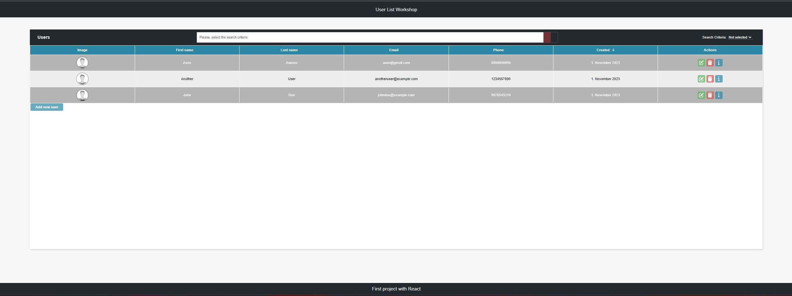
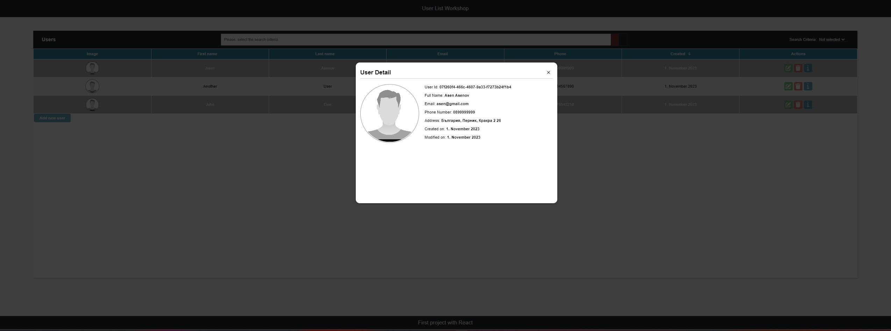
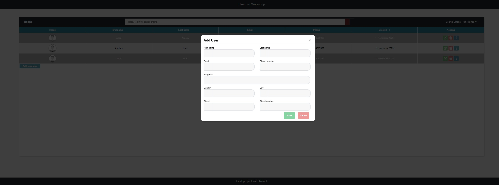
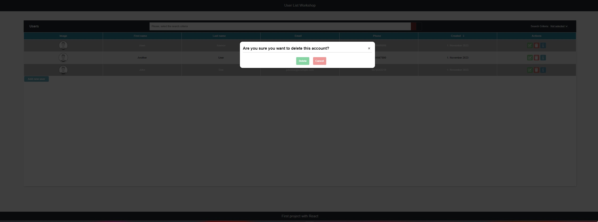

гит 
<h1>My Fisrt Project with Python</h1>
<h2>Home</h2>

This is the homepage of my project, which manages user data.

<h2>Info</h2>

By clicking the information button, a window opens that provides more details about the selected person.

<h2>Add</h2>

Clicking the 'Add new user' button opens a new window where you can fill in the details and register a new user.

<h2>Delete</h2>

After clicking the 'delete' button, a dialog box appears, prompting for confirmation to delete the selected user. Once confirmed, the user is deleted from the server and removed from the DOM tree.

